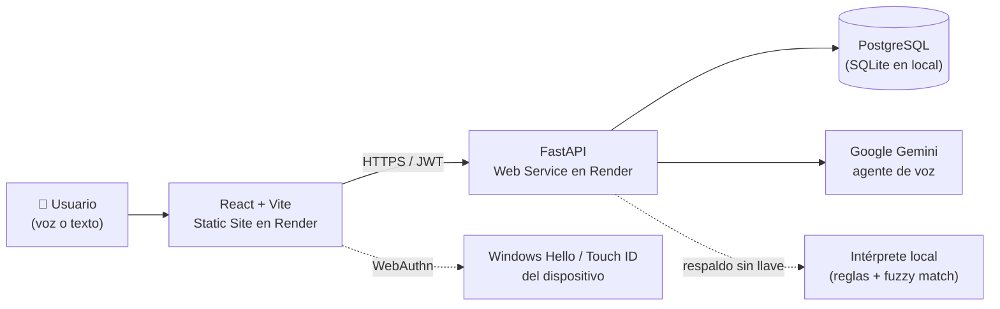

# CuentaVoz

### Plataforma inteligente para la captura de inventarios por voz

**Desarrollado por el equipo StockXperts** 🚀

 

*Reto de Hotelería · Hackathon Colsubsidio × 30X · julio de 2026*

 

## Índice

[Descripción](#-descripción) · [Características](#-características-principales) · [Capturas](#️-capturas) ·
[Arquitectura](#-arquitectura) · [Momentos que cubre](#-los-tres-momentos-manuales-que-cubre) ·
[Ingreso seguro](#-ingreso-seguro) · [Datos reales](#-datos-reales) · [Tecnologías](#-tecnologías) ·
[Seguridad](#-seguridad) · [Ejecutar / Desplegar](#️-ejecutar-y-desplegar) · [Equipo](#-equipo--stockxperts)

---

## 📌 Descripción

CuentaVoz es un asistente conversacional por voz para la captura de
información en las cocinas y bodegas de Colsubsidio. Hoy esa información
entra al sistema pasando por papel — alguien escribe, otro digita — y ahí
nacen los errores: un «9» que se vuelve «90», una unidad mal leída, un
producto confundido con otro parecido.

CuentaVoz escucha, entiende cómo habla la bodega, concilia contra el
catálogo oficial, valida al instante y registra directo en digital —
integrando pedidos, conteos, legalización, auditoría, recetas y reportes en
una sola plataforma, con datos reales de Colsubsidio desde el primer
momento.

## ✨ Características principales

| | |
|---|---|
| 🎙️ **Pedidos por voz** | «hoy preparamos cincuenta ajiacos» → explota la receta, descuenta el stock y calcula solo lo que falta pedir |
| 🧮 **Conteo conversacional** | dicta las cantidades, el agente concilia contra el catálogo oficial y valida en el momento |
| 👩‍🍳 **Recetas administrables** | ingredientes, rendimiento y preparación paso a paso, editables desde Ajustes |
| ✅ **Aprobación de pedidos** | el auditor revisa y aprueba antes de que el pedido salga al almacén |
| 🔐 **Ingreso seguro** | usuario o código de empleado, perfil detectado solo, y huella del dispositivo (WebAuthn) |
| 📊 **Panel gerencial** | exactitud por bodega, diferencias, stock por unidad, listo para Power BI |
| 📁 **Reportes y trazabilidad** | consolidados exportables y bitácora inmutable de cada acción |
| ☁️ **Listo para producción** | Render (Static Site + Web Service + PostgreSQL), documentado paso a paso |

## 🖼️ Capturas

Todas las vistas funcionando en **modo tablet** (el diseño responsivo real de la aplicación, no un mockup de escritorio).

<table>
<tr>
<td width="50%"> Ingreso con detección automática de perfil</td>
<td width="50%"> Inicio: lo que hay para hoy, según el perfil</td>
</tr>
<tr>
<td width="50%"> Pedidos por voz: receta + stock = pedido calculado</td>
<td width="50%"> Conteo: tablero de bodegas listas para contar</td>
</tr>
<tr>
<td width="50%"> Legalización de pedidos y líneas de servicio</td>
<td width="50%"> Bodegas: estado en vivo, filtros y doble firma</td>
</tr>
<tr>
<td width="50%"> Auditoría: recuento ciego, aprobaciones y cierre</td>
<td width="50%"> Reportes y trazabilidad exportable</td>
</tr>
<tr>
<td width="50%"> Panel gerencial: exactitud, diferencias y stock</td>
<td width="50%"> Ajustes: catálogo, recetas y configuración</td>
</tr>
<tr>
<td width="50%"> Ayuda: preguntas frecuentes y comandos de voz</td>
<td width="50%"> Mi perfil: datos personales y seguridad de la cuenta</td>
</tr>
</table>

## 🏗️ Arquitectura

Frontend y backend se despliegan por separado (un "Static Site" solo sirve
archivos; el backend necesita correr código de verdad) — ver
[Arquitectura de despliegue](DESPLIEGUE.md).

## ✅ Los tres momentos manuales que cubre

| Momento | Dónde | Qué hace |
|---|---|---|
| **1. Pedido al almacén** | menú Pedidos | «hoy preparamos cincuenta ajiacos» → explota la receta, descuenta el stock y pide solo lo que falta |
| **2. Toma física** | menú Conteo y Bodegas | dicta y el agente concilia, valida y registra |
| **3. Legalización** | menú Legalización | lo pedido contra lo usado, con sobrante y merma explicados |

### 🛡️ Lo que valida antes de guardar

- **Nombres que no coinciden:** «tabla para picar blanca» → `TABLA ACRILICA PICAR BLANCO 50X38CM FB` (97503004). Y cuando hay dos candidatas, pregunta.
- **Cantidades fuera de lo esperado:** «noventa cazuelas» → *«el sistema espera alrededor de 10, ¿confirma 90?»*
- **Unidades equivocadas:** «cinco kilos» no se confunde con cinco gramos.
- **Saldos imposibles:** una cantidad negativa se rechaza con explicación.

## 🔐 Ingreso seguro

Usuario o código de empleado + PIN, con el perfil (auxiliar / administrador)
detectado solo al escribir — nadie tiene que elegirlo a mano. Cada persona
puede además registrar la huella de su propio dispositivo (WebAuthn: Windows
Hello, Touch ID o huella de Android) para entrar sin volver a teclear el PIN
en ese equipo.

## 📊 Datos reales

El prototipo carga el extracto entregado por Colsubsidio:
**53 bodegas · 1.041 artículos · 1.405 registros de stock · 79 saldos
negativos detectados** (el mini reto).

---

## 🚀 Tecnologías

<table>
<tr><td><b>Backend</b></td><td>Python · FastAPI · SQLAlchemy · SQLite (local) / PostgreSQL (producción) · JWT + bcrypt · WebAuthn · Google Gemini AI</td></tr>
<tr><td><b>Frontend</b></td><td>React · Vite · CSS propio, sin framework de UI</td></tr>
<tr><td><b>Despliegue</b></td><td>Render (Static Site + Web Service) · Docker / docker-compose para desarrollo local</td></tr>
</table>

## 🔒 Seguridad

Contraseñas con bcrypt, sesiones con token JWT que vence, ingreso opcional
con huella del dispositivo (WebAuthn), permisos por perfil, consultas por
ORM, secretos fuera del repositorio y registro de trazabilidad inmutable.
Alineado con la Ley 1581 de 2012.

---

## ▶️ Ejecutar y desplegar

| | |
|---|---|
| 💻 **Local** | Requisitos, pasos verificados de punta a punta → **[LEEME_PRIMERO.md](LEEME_PRIMERO.md)** |
| ☁️ **Render** | Static Site + Web Service + PostgreSQL, paso a paso → **[DESPLIEGUE.md](DESPLIEGUE.md)** |
| 🤖 **El agente** | Manual técnico de construcción → **[Guía técnica del agente]([docs/capturas/Guia_Tecnica_Agente_CuentaVoz_V3.1.pdf])** |
| 🌐 **Demo** | **https://cuentavoz.onrender.com**  |
| 🎥 **Video** | *Próximamente* |

### 🔑 Acceso de prueba

La aplicación crea estos usuarios sola la primera vez que arranca (ver
`backend/main.py: arranque()`):

| Usuario | Código de empleado | PIN | Perfil |
|---|---|---|---|
| `luis` | `CS-48127` | `StockXperts` | Auxiliar de inventarios |
| `diana` | `CS-48200` | `StockXperts` | Administradora de bodega |
| `stephanie` | `CS-48311` | `StockXperts` | Auxiliar de inventarios |
| `valentina` | `CS-48342` | `StockXperts` | Auxiliar de inventarios |

Se puede entrar con el usuario o con el código de empleado, indistintamente.

---

## 👥 Equipo – StockXperts

- 👨‍💻 **Luis Guillermo Nieto Patiño** — Diseño funcional y experiencia de usuario
- 👩‍💻 **Diana Carolina Argüello Casallas** — Análisis de requerimientos y documentación
- 👩‍💻 **Valentina Burbano Salazar** — Desarrollo Full Stack, arquitectura e integración de IA
- 👩‍💻 **Luz Stephanie Puentes Morantes** — Validación funcional y apoyo al desarrollo

---

Proyecto desarrollado para la **Hackatón Colsubsidio × 30X**.

© 2026 — **Equipo StockXperts**

