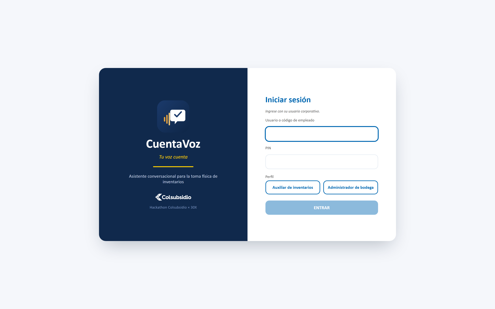
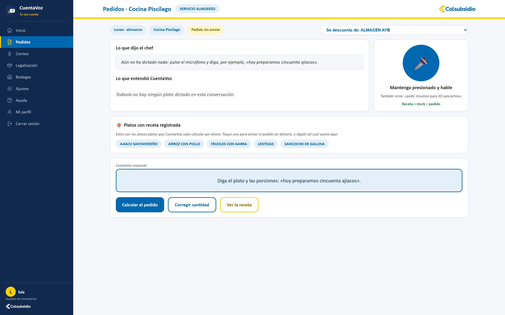

# 🎙️ CuentaVoz

### Plataforma inteligente para la captura de inventarios por voz

**Desarrollado por el equipo StockXperts** 🚀

*Reto de Hotelería · Hackathon Colsubsidio × 30X · julio de 2026*

---

## 📌 Descripción

CuentaVoz es un asistente conversacional por voz para la captura de
información en las cocinas y bodegas de Colsubsidio. Hoy esa información
entra al sistema pasando por papel — alguien escribe, otro digita — y ahí
nacen los errores: un «9» que se vuelve «90», una unidad mal leída, un
producto confundido con otro parecido.

CuentaVoz escucha, entiende cómo habla la bodega, concilia contra el
catálogo oficial, valida al instante y registra directo en digital —
integrando pedidos, conteos, legalización, auditoría y reportes en una
sola plataforma, con datos reales de Colsubsidio desde el primer momento.

---

## 🖼️ Capturas

  

---

## ✅ Los tres momentos manuales que cubre

| Momento | Dónde | Qué hace |
|---|---|---|
| **1. Pedido al almacén** | menú Pedidos | «hoy preparamos cincuenta ajiacos» → explota la receta, descuenta el stock y pide solo lo que falta |
| **2. Toma física** | menú Conteo y Bodegas | dicta y el agente concilia, valida y registra |
| **3. Legalización** | menú Legalización | lo pedido contra lo usado, con sobrante y merma explicados |

## 🛡️ Lo que valida antes de guardar

- **Nombres que no coinciden:** «tabla para picar blanca» → `TABLA ACRILICA PICAR BLANCO 50X38CM FB` (97503004). Y cuando hay dos candidatas, pregunta.
- **Cantidades fuera de lo esperado:** «noventa cazuelas» → *«el sistema espera alrededor de 10, ¿confirma 90?»*
- **Unidades equivocadas:** «cinco kilos» no se confunde con cinco gramos.
- **Saldos imposibles:** una cantidad negativa se rechaza con explicación.

## 🔐 Ingreso seguro

Usuario o código de empleado + PIN, con el perfil (auxiliar / administrador)
detectado solo al escribir — nadie tiene que elegirlo a mano. Cada persona
puede además registrar la huella de su propio dispositivo (WebAuthn: Windows
Hello, Touch ID o huella de Android) para entrar sin volver a teclear el PIN
en ese equipo.

## 📊 Datos reales

El prototipo carga el extracto entregado por Colsubsidio:
**54 bodegas · 1.041 artículos · 1.406 registros de stock · 79 saldos
negativos detectados** (el mini reto).

---

## 🚀 Tecnologías utilizadas

**Backend** — Python · FastAPI · SQLAlchemy · SQLite (local) / PostgreSQL
(producción) · JWT + bcrypt · WebAuthn · Google Gemini AI

**Frontend** — React · Vite · CSS propio (sin framework de UI)

**Despliegue** — Render (Static Site + Web Service) · Docker / docker-compose
para desarrollo local

## 🔒 Seguridad

Contraseñas con bcrypt, sesiones con token JWT que vence, ingreso opcional
con huella del dispositivo (WebAuthn), permisos por perfil, consultas por
ORM, secretos fuera del repositorio y registro de trazabilidad inmutable.
Alineado con la Ley 1581 de 2012.

---

## ▶️ Ejecutar el proyecto localmente

Ver la guía completa, con requisitos y pasos verificados de punta a punta:
**[LEEME_PRIMERO.md](LEEME_PRIMERO.md)**

## ☁️ Desplegar en Render

Ver la guía completa (Static Site + Web Service + PostgreSQL):
**[DESPLIEGUE.md](DESPLIEGUE.md)**

## 🌐 Demo

*Próximamente — el enlace se agrega aquí una vez desplegado en Render.*

## 🎥 Video demostrativo

*Próximamente.*

---

## 👥 Equipo – StockXperts

- 👨‍💻 **Luis Guillermo Nieto Patiño** — Diseño funcional y experiencia de usuario
- 👩‍💻 **Diana Carolina Argüello Casallas** — Análisis de requerimientos y documentación
- 👩‍💻 **Valentina Burbano Salazar** — Desarrollo Full Stack, arquitectura e integración de IA
- 👩‍💻 **Luz Stephanie Puentes Morantes** — Validación funcional y apoyo al desarrollo

---

Proyecto desarrollado para la **Hackatón Colsubsidio × 30X**.

© 2026 — **Equipo StockXperts**

