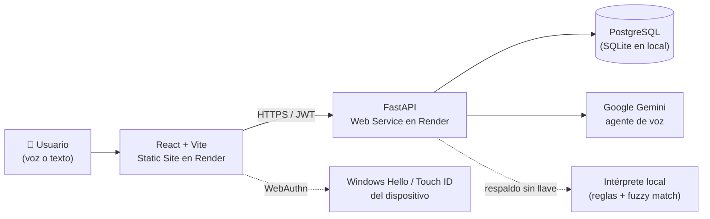

# CuentaVoz

### Plataforma inteligente para la captura de inventarios por voz

**Desarrollado por el equipo StockXperts** 🚀

 

*Reto de Hotelería · Hackathon Colsubsidio × 30X · julio de 2026*

 

## Índice

[Descripción](#-descripción) · [Características](#-características-principales) · [Capturas](#️-capturas) ·
[Arquitectura](#-arquitectura) · [Momentos que cubre](#-los-tres-momentos-manuales-que-cubre) ·
[Accesibilidad](#-accesibilidad) · [Ingreso seguro](#-ingreso-seguro) · [Datos reales](#-datos-reales) ·
[Tecnologías](#-tecnologías) · [Seguridad](#-seguridad) · [Ejecutar / Desplegar](#️-ejecutar-y-desplegar) ·
[Equipo](#-equipo--stockxperts)

---

## 📌 Descripción

CuentaVoz es un asistente conversacional por voz para la captura de
información en las cocinas y bodegas de Colsubsidio. Hoy esa información
entra al sistema pasando por papel — alguien escribe, otro digita — y ahí
nacen los errores: un «9» que se vuelve «90», una unidad mal leída, un
producto confundido con otro parecido.

CuentaVoz escucha, entiende cómo habla la bodega, concilia contra el
catálogo oficial, valida al instante y registra directo en digital —
integrando pedidos, conteos, legalización, auditoría, recetas y reportes en
una sola plataforma, con datos reales de Colsubsidio desde el primer
momento.

### 🎬 Así se ve en acción

Real contra producción: se elige un plato, se confirma la cantidad y CuentaVoz calcula
solo lo que falta pedir — sin datos inventados.

## ✨ Características principales

| | |
|---|---|
| 🎙️ **Pedidos por voz** | «hoy preparamos cincuenta ajiacos» → explota la receta, descuenta el stock y calcula solo lo que falta pedir |
| 🧮 **Conteo conversacional** | dicta las cantidades, el agente concilia contra el catálogo oficial y valida en el momento |
| 👩‍🍳 **Recetas administrables** | ingredientes, rendimiento y preparación paso a paso, editables desde Ajustes |
| ✅ **Aprobación de pedidos** | el auditor revisa y aprueba antes de que el pedido salga al almacén |
| 🔐 **Ingreso seguro** | usuario o código de empleado, perfil detectado solo, y huella del dispositivo (WebAuthn) |
| 📊 **Panel gerencial** | exactitud por bodega, diferencias, stock por unidad, listo para Power BI |
| 📁 **Reportes y trazabilidad** | consolidados exportables y bitácora inmutable de cada acción |
| ☁️ **Listo para producción** | Render (Static Site + Web Service + PostgreSQL), documentado paso a paso |

## 🖼️ Capturas

Todas las vistas funcionando en **modo tablet** (el diseño responsivo real de la aplicación, no un mockup de escritorio).

**Inicio** — lo que hay para hoy, según el perfil

**Bodegas** — estado en vivo, filtros y doble firma

**Panel gerencial** — exactitud, diferencias y stock

<b>Ver las otras 11 capturas</b> (Ingreso, Pedidos, Conteo, Legalización, Auditoría, Reportes, Ajustes, Ayuda, Mi perfil, Mensajes, Cerrar sesión) — Inicio, Bodegas y Panel ya se ven arriba, sin repetir

**Ingreso** — detección automática de perfil

**Pedidos por voz** — receta + stock = pedido calculado

**Conteo** — tablero de bodegas listas para contar

**Legalización** — pedidos y líneas de servicio

**Auditoría** — recuento ciego, aprobaciones y cierre

**Reportes** — trazabilidad exportable

**Ajustes** — catálogo, recetas y configuración

**Ayuda** — preguntas frecuentes y comandos de voz

**Mi perfil** — datos personales y seguridad de la cuenta

**Mensajes** — soporte en vivo entre auxiliares y administrador

**Cerrar sesión** — confirma antes de salir si hay trabajo sin guardar

### 📱 En celular

El mismo diseño responsivo, en el punto de quiebre de teléfono
(≤600px): el menú lateral pasa a una barra horizontal deslizable arriba,
en vez de la columna de íconos de la tablet.

**Inicio**

&nbsp;&nbsp;
**Pedidos**

&nbsp;&nbsp;
**Bodegas**

## 🏗️ Arquitectura

Frontend y backend se despliegan por separado (un "Static Site" solo sirve
archivos; el backend necesita correr código de verdad) — ver
[Arquitectura de despliegue](DESPLIEGUE.md).

## ✅ Los tres momentos manuales que cubre

| Momento | Dónde | Qué hace |
|---|---|---|
| **1. Pedido al almacén** | menú Pedidos | «hoy preparamos cincuenta ajiacos» → explota la receta, descuenta el stock y pide solo lo que falta |
| **2. Toma física** | menú Conteo y Bodegas | dicta y el agente concilia, valida y registra |
| **3. Legalización** | menú Legalización | concilia lo pedido contra lo usado, con sobrante y merma explicados |

### 🛡️ Lo que valida antes de guardar

- **Nombres que no coinciden:** «tabla para picar blanca» → `TABLA ACRILICA PICAR BLANCO 50X38CM FB` (97503004). Y cuando hay dos candidatas, pregunta.
- **Cantidades fuera de lo esperado:** «noventa cazuelas» → *«el sistema espera alrededor de 10, ¿confirma 90?»*
- **Unidades equivocadas:** «cinco kilos» no se confunde con cinco gramos.
- **Saldos imposibles:** una cantidad negativa se rechaza con explicación.

## ♿ Accesibilidad

Pensada para que la use cualquier persona, incluida gente con discapacidad —
un criterio que Colsubsidio pidió explícitamente para este reto, no un
agregado de último momento:

- **Navegación completa por teclado:** el menú principal, los modales y
  todos los campos se manejan sin mouse (Tab, Enter, Escape).
- **Etiquetas accesibles** en los controles que solo tenían un ícono:
  micrófonos, interruptores y grupos de botones usados como selectores.
- **Foco visible** en toda la aplicación, con contraste verificado contra
  el estándar WCAG AA tanto en el sidebar oscuro como en el resto de
  pantallas claras.
- **Modales semánticos** (`role="dialog"`, foco atrapado, cierre con
  Escape) en vez de simples `
` con estilo de ventana.
- **Regiones en vivo** (`aria-live`) para que un lector de pantalla
  anuncie las respuestas del agente sin que el usuario tenga que ir a
  buscarlas.
- **Soporte para movimiento reducido**, respetando la preferencia del
  sistema operativo.
- **Áreas táctiles** de al menos 44px, cómodas también en tablet.

Diseñada y verificada siguiendo las pautas WCAG 2.1 AA — no reemplaza una
auditoría formal con lectores de pantalla certificados, pero cubre las
fallas que hoy suelen dejar afuera a un usuario que no usa mouse.

## 🔐 Ingreso seguro

Usuario o código de empleado + PIN, con el perfil (auxiliar / administrador)
detectado solo al escribir — nadie tiene que elegirlo a mano. Cada persona
puede además registrar la huella de su propio dispositivo (WebAuthn: Windows
Hello, Touch ID o huella de Android) para entrar sin volver a teclear el PIN
en ese equipo.

## 📊 Datos reales

El prototipo carga el extracto entregado por Colsubsidio:
**54 bodegas · 1.041 artículos · 1.405 registros de stock · 79 saldos
negativos detectados** (el mini reto).

---

## 🚀 Tecnologías

<table>
<tr><td><b>Backend</b></td><td>Python · FastAPI · SQLAlchemy · SQLite (local) / PostgreSQL (producción) · JWT + bcrypt · WebAuthn · Google Gemini AI</td></tr>
<tr><td><b>Frontend</b></td><td>React · Vite · CSS propio, sin framework de UI</td></tr>
<tr><td><b>Despliegue</b></td><td>Render (Static Site + Web Service) · Docker / docker-compose para desarrollo local</td></tr>
</table>

## 🔒 Seguridad

Contraseñas con bcrypt, sesiones con token JWT que vence (invalidado por
completo al cambiar el PIN o cerrar todas las sesiones), cambio de PIN
que exige el PIN vigente, ingreso opcional con huella del dispositivo
(WebAuthn real), permisos por perfil reforzados también por asignación
de bodega (auditados con tests de regresión), consultas por ORM sin SQL
armado a mano, límite de tasa en los endpoints sensibles, cabeceras de
seguridad (incluida HSTS), secretos fuera del repositorio y registro de
trazabilidad inmutable. Alineado con la Ley 1581 de 2012. Detalle
técnico en **[ARQUITECTURA.md](ARQUITECTURA.md#seguridad)**.

---

## ▶️ Ejecutar y desplegar

| | |
|---|---|
| 💻 **Local** | Requisitos, pasos verificados de punta a punta → **[LEEME_PRIMERO.md](LEEME_PRIMERO.md)** |
| ☁️ **Render** | Static Site + Web Service + PostgreSQL, paso a paso → **[DESPLIEGUE.md](DESPLIEGUE.md)** |
| 🧭 **Arquitectura** | Mapa del código, por qué cada librería, modelo de datos → **[ARQUITECTURA.md](ARQUITECTURA.md)** |
| 🤖 **El agente** | Manual técnico de construcción → **[Guía técnica del agente](docs/capturas/Guia_Tecnica_Agente_CuentaVoz_V3.1.pdf)** |
| 🌐 **Demo** | **https://cuentavoz.onrender.com**  |
| 🎥 **Video** | **https://www.youtube.com/watch?v=4tSRTV5POd4** |

### 🔑 Acceso de prueba

La aplicación crea estos usuarios sola la primera vez que arranca (ver
`backend/main.py: arranque()`):

| Usuario | Código de empleado | PIN | Perfil |
|---|---|---|---|
| `luis` | `CS-48127` | `StockXperts` | Auxiliar de inventarios |
| `diana` | `CS-48200` | `StockXperts` | Administradora de bodega |
| `stephanie` | `CS-48311` | `StockXperts` | Auxiliar de inventarios |
| `valentina` | `CS-48342` | `StockXperts` | Auxiliar de inventarios |

Se puede entrar con el usuario o con el código de empleado, indistintamente.

---

## 👥 Equipo – StockXperts

- 👨‍💻 **Luis Guillermo Nieto Patiño** — Diseño funcional y experiencia de usuario
- 👩‍💻 **Diana Carolina Argüello Casallas** — Análisis de requerimientos y documentación
- 👩‍💻 **Valentina Burbano Salazar** — Desarrollo Full Stack, arquitectura e integración de IA
- 👩‍💻 **Luz Stephanie Puentes Morantes** — Validación funcional y apoyo al desarrollo

---

Proyecto desarrollado para la **Hackatón Colsubsidio × 30X**.

© 2026 — **Equipo StockXperts**

