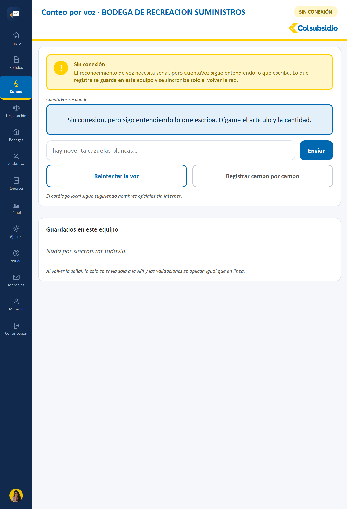
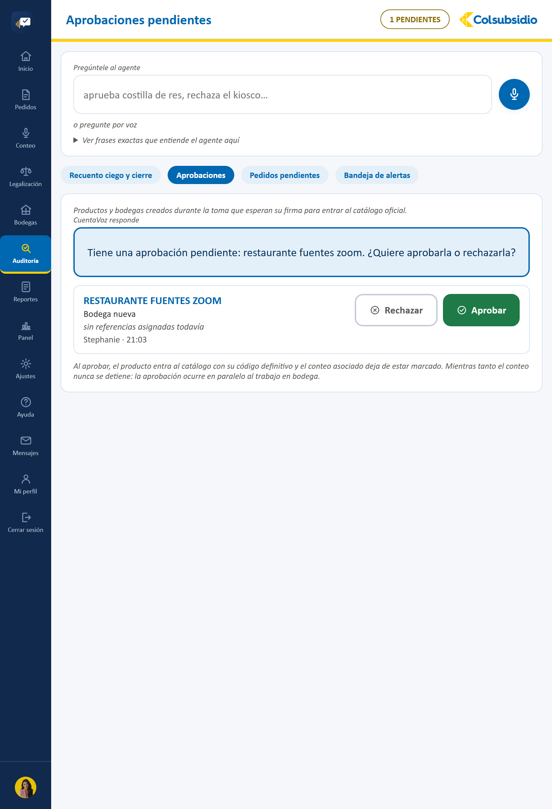
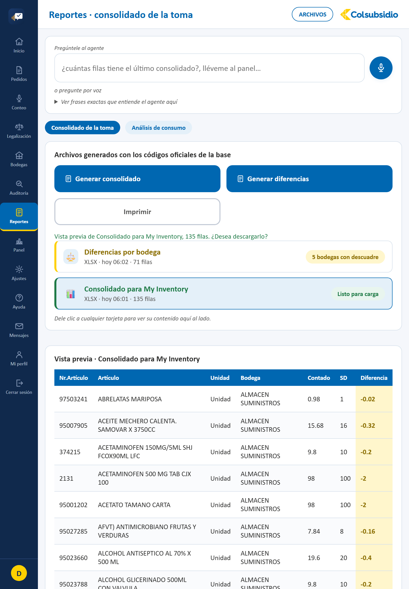

# Manual de usuario — CuentaVoz

Guía corta, paso a paso, para usar CuentaVoz en el día a día — pensada para
quien cuenta inventario en bodega o audita el cierre, no para quien
programa. Si busca cómo está construida la aplicación, vea
[ARQUITECTURA.md](../ARQUITECTURA.md); este manual es solo de uso.

CuentaVoz tiene dos perfiles, con pantallas distintas según cuál tenga su
cuenta:

- **Auxiliar de inventarios** — cuenta, hace pedidos y legaliza turnos.
- **Administrador de bodega** — además audita, aprueba y genera reportes.

## Índice

1. [Ingresar y registrarse](#1-ingresar-y-registrarse)
2. [Inicio](#2-inicio)
3. [Contar por voz](#3-contar-por-voz)
4. [Pedidos por voz](#4-pedidos-por-voz)
5. [Bodegas](#5-bodegas)
6. [Legalización](#6-legalización)
7. [Auditoría, aprobaciones y cierre](#7-auditoría-aprobaciones-y-cierre-solo-administrador)
8. [Panel y Reportes](#8-panel-y-reportes-solo-administrador)
9. [Mi perfil](#9-mi-perfil)
10. [Ajustes y gestión de usuarios](#10-ajustes-y-gestión-de-usuarios-solo-administrador)
11. [Ayuda y mensajes](#11-ayuda-y-mensajes)
12. [Cerrar sesión](#12-cerrar-sesión)

---

## 1. Ingresar y registrarse

- **Ya tiene cuenta**: escriba su usuario y clave, elija su perfil y toque
  **Entrar**.
- **Cuenta nueva**: toque **Crear una cuenta**, llene nombre, correo y una
  clave que cumpla los requisitos que se marcan en verde a medida que
  escribe. Le llega un código de 6 dígitos al correo — confírmelo y ya
  puede entrar.
- **Olvidó su clave**: toque **Olvidé mi clave**, llega un código al
  correo registrado y elige una clave nueva.
- **Verificación en dos pasos (opcional)**: recién registrado, se le
  ofrece activarla (puede saltarla). También se activa o desactiva después
  desde [Mi perfil](#9-mi-perfil).

## 2. Inicio

Resumen del día apenas entra: bodegas asignadas, referencias contadas hoy,
alertas por revisar, y accesos directos a Contar, Ver el tablero, Hacer un
pedido y Legalizar.

## 3. Contar por voz

1. Elija la bodega (por voz o buscándola).
2. Toque el micrófono y diga el artículo y la cantidad, por ejemplo
   **«arroz veinte kilos»**.
3. CuentaVoz repite lo que entendió antes de guardar — confirme con «sí» o
   corríjalo diciendo **«corregir»** y el valor correcto.
4. Si el artículo no existe todavía en el catálogo, queda pendiente de
   aprobación del administrador (ver [sección 7](#7-auditoría-aprobaciones-y-cierre-solo-administrador))
   y usted sigue contando normalmente.

**Sin conexión**: si se cae el Wi-Fi, CuentaVoz sigue funcionando con un
formulario escrito — lo contado se guarda en el equipo
() y se sincroniza
solo apenas vuelve la señal. Mientras haya algo pendiente de sincronizar,
un aviso amarillo (**«N por sincronizar»**) se ve en la esquina inferior
de la barra lateral, en cualquier pantalla en la que esté.

## 4. Pedidos por voz

Elija un plato del catálogo, diga cuántas porciones necesita y CuentaVoz
calcula los insumos comparando lo que hay contra lo que hace falta, antes
de enviar el pedido al almacén.

## 5. Bodegas

Estado en vivo de todas las bodegas (abiertas, cerradas, en auditoría) y
buscador de artículos por nombre, con movimientos y comparación contra la
receta.

## 6. Legalización

Registro del sobrante y la merma del turno, con ajuste por voz cuando el
número no cuadra con lo esperado.

## 7. Auditoría, aprobaciones y cierre (solo Administrador)

- **Recuento ciego y cierre**: recuente una bodega sin ver los números del
  auxiliar, compare y cierre con doble firma.
- **Aprobaciones**: productos y bodegas nuevas que un auxiliar contó pero
  no existían todavía en el catálogo — apruebe o rechace cada uno
  ().
- **Cuentas nuevas pendientes**: alguien que se registró por su cuenta no
  puede entrar hasta que usted apruebe su registro y le asigne perfil
  (auxiliar o administrador) — vea la pestaña correspondiente, mismo lugar
  que las aprobaciones de productos/bodegas.
- **Bandeja de alertas** y **Pedidos pendientes**: diferencias por revisar
  y pedidos por confirmar.

## 8. Panel y Reportes (solo Administrador)

Resumen ejecutivo (diferencias, alertas por tipo), y generación de los
reportes para My Inventory: consolidado, detalle por bodega, análisis de
consumo y trazabilidad completa
().

## 9. Mi perfil

- Datos personales, bodegas asignadas y última vez que ingresó.
- **Cambiar clave** y **verificación en dos pasos** (activar/desactivar).
- **Preferencias de voz**: qué voz usa CuentaVoz, qué tan rápido habla, y
  si confirma en voz alta lo que va guardando.
- **Accesibilidad**: alto contraste y tamaño de letra más grande — se
  aplican de inmediato en este equipo, sin necesidad de guardar.

## 10. Ajustes y gestión de usuarios (solo Administrador)

Umbral de alertas, modo sin conexión, gestión de usuarios (crear, editar,
asignar bodegas), recetas y registro de trazabilidad completo.

## 11. Ayuda y mensajes

Preguntas frecuentes, guía de comandos de voz, y un cuadro para
preguntarle directo al agente. El botón **Ver el recorrido guiado** repite
la introducción de 2-3 pasos que se muestra la primera vez que alguien
entra a CuentaVoz. **Mensajes** es la bandeja para escribirle al
administrador (o, si usted es administrador, responder a su equipo).

## 12. Cerrar sesión

Cierra la sesión en este dispositivo. Si necesita cerrarla en **todos**
los dispositivos donde haya entrado (por ejemplo, una tableta compartida),
use el botón correspondiente en Mi perfil.
